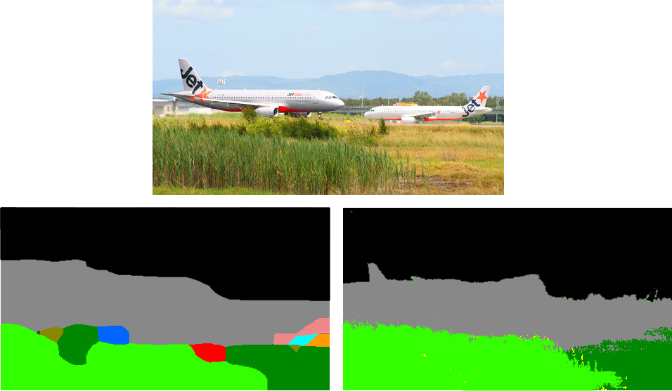

# CRF-as-RNN Layer for [Pytorch](https://github.com/pytorch/pytorch)

This repository contains an implementation of the CRF-as-RNN method
[described here](http://www.robots.ox.ac.uk/~szheng/CRFasRNN.html). Please cite
their work if you use this in your own code. I am not affiliated with their
group, this is just a side-project.

The pytorch module relies on two Functions: one to build the hashtable
representing a [permutohedral
lattice](http://graphics.stanford.edu/papers/permutohedral/permutohedral.pdf)
and another to perform the high-dimensional Gaussian filtering required by
approximate CRF inference.

## Setup

For inplace use / testing:

```
python setup.py build_ext --inplace
```

Or, to install the packages (permutohedral, crfrnn):

```
python setup.py install
```

## Pytorch Module
[](images/crf_layer_example.png)

The [Pytorch](https://github.com/pytorch/pytorch) module takes two inputs for
the forward pass: a probability map (typically the output of a softmax layer),
and a reference image (typically the image being segmented/densely-classified).
Optional additional parameters may be provided to the module on construction:

* `sxy_bf`: spatial standard deviation for the bilateral filter.
* `sc_bf`: color standard deviation for the bilateral filter.
* `compat_bf`: label compatibility weight for the bilateral filter.
* `sxy_spatial`: spatial standard deviation for the 2D Gaussian filter.
* `compat_spatial`: label compatibility weight for the 2D Gaussian filter.

**Note**: the default color standard deviation assumes the input is a color
image in the range [0, 255]. If you use whitened or otherwise-normalized images,
you should change this value.

Here is a simple example:

```python
import torch as th

from crfrnn import CRF

n_categories = 32

class MyCNN(th.nn.Module):
    def __init__(self):
        super(MyCNN, self).__init__()
        self.relu = th.nn.ReLU()
        self.conv1 = th.nn.Conv2d(3, 64, 3, 1, 1)
        self.conv2 = th.nn.Conv2d(64, 64, 3, 1, 1)
        self.final = th.nn.Conv2d(64, n_categories, 3, 1, 1)
        self.crf = CRF()

    def forward(self, x):
        input = x
        x = self.relu(self.conv1(x))
        x = self.relu(self.conv2(x))
        x = th.softmax(self.final(x), dim=1)
        x = self.crf(x, input)
        return x

img = th.zeros(1, 3, 384, 512, device="cuda:0")
model = MyCNN()
model.to(device="cuda:0")
model(img)
```

## Sub-Functions

The functions used for CRF inference can also be used on their own for things
like bilateral filtering. [bilateral.py](bilateral.py) contains a sample
implementation.

`python bilateral.py input.png output.png 20 0.25`

 
